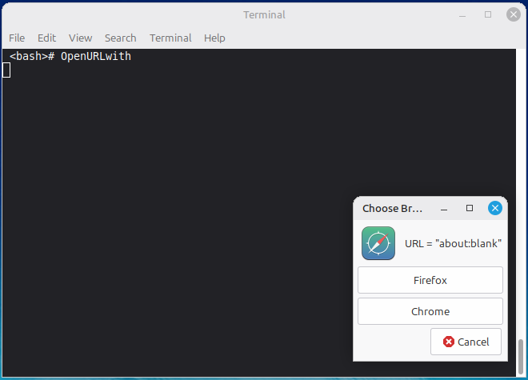

# OpenURLwith

An HTTP(S) mime-type browser-chooser "system" for Linux desktops.  Really, it's just 2 files and some instructions...

## The Problem to solve

**Scenario:** I click on a link in an email, and it pops open a tab in
whatever last FireFox window I had.  *BUT*!  I really need it to open in
Chrome because that's where I do whatever with a Google account (which I
never use my FireFox for...).

**A Solution:** Make my *default web browser* a dialog which allows me to
pick my web application.  I'm going to call that _OpenURLwith_.

###  Todo

**Profiles:** Drop down -- It would be great to select which profile to open a
website with -- I use profiles in both FireFox and Chrome.

## Requirements

Development done using Linux Mint MATE 22.3 and Debian 13 Mate.  My
guess/hope is that any mondernish freedesktop.org "compliant"
Linux should work. 

* BASH
* [YAD](https://github.com/v1cont/yad) -- See the yad-build-notes.md for
  how I installed it.  Repository versions are quite old, but seem to
  work well enough for this purpose.

## Installation

#### 1. Download/save the **OpenURLwith** script and **OpenURLwith.desktop**:

Put the **OpenURLwith** script someplace in your $PATH, and make
executable.  I leave mine in ~/bin:

`cp OpenURLwith $HOME/bin; chmod 755 $HOME/bin/OpenURLwith`

#### 2.  Run `OpenURLwith` from the command line:

It will open blank windows if not given a URL:

Trouble shoot this if it doesn't work!  Is **OpenURLwith** executable and in your **$PATH**?  Is YAD installed correctly?

#### 3. Install the desktop file:

`cp OpenURLwith.desktop $HOME/.local/share/applications`

In a GUI file browser, navigate to that file, double click on it, and do whatever your desktop environment requires to "trust" it for launching. 

*This is often the hardest thing to get working right*.

Possibly may need to register the file:
`update-desktop-database ~/.local/share/applications`

At this point, you should be able to see **OpenURLwith** in your
Desktop's application menu, and hopefully as an option in a
*default/preferred application* setting for your Desktop Environment.

If you need to force it as the default browser, this should work:
`xdg-settings set default-web-browser OpenURLwith.desktop`

## Configuration

The only real configuration involves editing the **OpenURLwith** script.
Namely, adding/removing *Launchers* definitions and invocations. 

The `.desktop` file has an *Exec* line -- the debugging flag might be set, and can be edited out.

## Testing

Clicking on an html file, or running `xdg-open URL` should trigger the
script.

